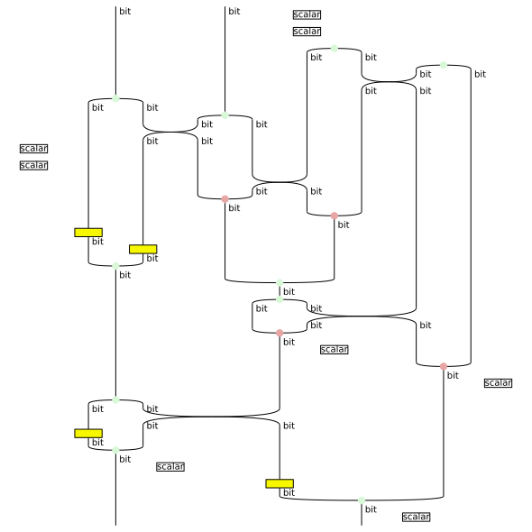
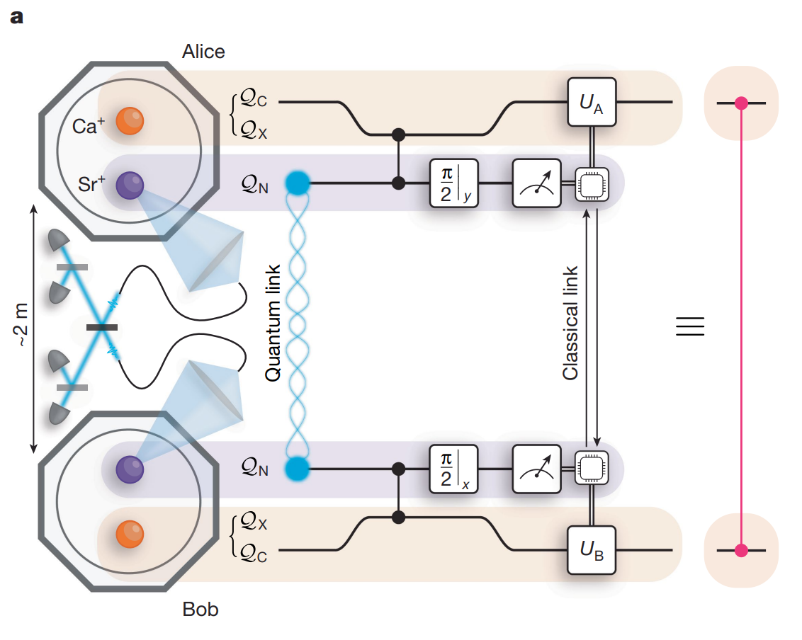
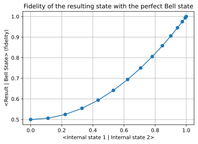

# Optyx: A ZX-based Python library for networked quantum architectures

Optyx is an open-source Python library for designing, simulating, and optimizing networked, hybrid qubit–photon architectures. It offers a compositional, ZX/ZW-based, string-diagram front end (built within the [DisCoPy](https://github.com/discopy/discopy) ecosystem) that lets you specify experiments mixing qubit registers with discrete-variable photonic modes, lossy channels, heralded measurements, and classical/quantum feedback. Optyx compiles these diagrams to optimized tensor networks and executes them with state-of-the-art contraction backends ([Quimb](https://github.com/jcmgray/quimb) and [Cotengra](https://github.com/jcmgray/cotengra)), delivering substantial speedups on hybrid circuits. The result is an end-to-end workflow—from high-level syntax to numerics—well-suited for rapid prototyping of qubit-photon experiments.

## Basic syntax: the CNOT gate

Circuits in Optyx are **diagrams** made of **wires** and **boxes**. Wires represent different types of data such as quantum `qubit` and `qmode` or classical `bit` and `mode`. Boxes are basic processes with input and output wires that can be composed, in sequence or in parallel, to form diagrams.

### Monoidal syntax

In monoidal syntax, `>>` denotes sequential composition and `@` denotes parallel composition (also known as tensor product).
For example, you can build the CNOT gate from the **Z** and **X** generators of the **ZX caluclus** (don't forget the scalar!).

```python
from optyx import qubit
from optyx.qubits import Z, X, Scalar

cnot = Z(1, 2) @ qubit >> qubit @ X(2, 1) @ Scalar(2 ** 0.5)
cnot.draw()
```

### Function syntax

Alternatively, you can treat each generator as a **function** acting on **labelled wires** and **call the generators** 
directly on the labels. This makes complex diagrams easier to read and write, and mirrors the style used in [Guppy](https://github.com/CQCL/guppylang).

```python
@Channel.from_callable(
  dom=qubit @ qubit, cod=qubit @ qubit
)
def cnot(a, b):
  c, d = Z(1, 2)(a)
  e = X(2, 1)(d, b)
  Scalar(2 ** 0.5)()
  return c, e
```

## Qubit example: teleportation protocol

Quantum teleportation transfers an unknown qubit state from sender (Alice) to receiver (Bob) using shared entanglement and feedforward of two classical bits. Alice performs a joint Bell-state measurement on the unknown qubit and her half of an entangled pair, and sends the two-bit outcome to Bob, who applies a corresponding Pauli correction (I, X, Z, or XZ) to recover the exact state.

https://en.wikipedia.org/wiki/Quantum_teleportation#/media/File:Quantum_teleportation_circuit.svg :


### Define the protocol

Write the protocol using function syntax:

```python
from optyx import bit
from optyx.qubits import Measure
from optyx.classical import CtrlX, CtrlZ

bell = Scalar(0.5 ** 0.5) @ Z(0, 2)

@Channel.from_callable(
  dom=qubit, cod=qubit
)
def teleportation(c):
  a, b = bell()
  cc, aa = cnot(c, a)
  c_ = Measure(1)(H()(cc))
  a_ = Measure(1)(aa)
  bb = CtrlX(a_, b)
  return CtrlZ(c_, bb)
```

Or using monoidal syntax:

```python
teleportation_monoidal_syntax = (
    qubit @ bell >>
    cnot @ qubit >>
    H() @ qubit ** 2 >>
    Measure(1) @ Measure(1) @ qubit >>
    bit @ CtrlX >>
    CtrlZ
)
```

### Simulate using backends


```python
import numpy as np
from optyx.qubits import Id

np.allclose(
    teleportation.eval().tensor.array,
    teleportation_monoidal_syntax.eval().tensor.array,
    Id(1).double().to_tensor().eval().array
)
```

Optyx evaluates diagrams via pluggable backends. By default it compiles a diagram to a tensor network, optimizes a contraction path with **cotengra**, and contracts it with **quimb** (CPU/GPU; dense/sparse). For linear-optical circuits, Optyx also exposes a **Perceval** backend using permanent-based algorithms, and a tensor-network-based **DisCoPy** backend; you can choose among these depending on the task.

```python
from optyx.core.backends import (
    DiscopyBackend,
    QuimbBackend
)

np.allclose(
    teleportation.eval(DiscopyBackend()).tensor.array,
    teleportation.eval(QuimbBackend()).tensor.array
)
```


### Verify with PyZX

We can obtain the underlying CPTP map by doubling (CP-construction) an Optyx diagram:


```python
teleportation_monoidal_syntax.double().draw(figsize=(8, 8))
```





This way we can use [PyZX](https://github.com/zxcalc/pyzx) and its optimisation/simplifications functionalities:


```python
import pyzx
pyzx_graph = teleportation_monoidal_syntax.double().to_pyzx()
pyzx.full_reduce(pyzx_graph, quiet=True)
pyzx_graph.normalize()
pyzx.draw(pyzx_graph)
```


The diagram (a doubled identity) is the identity CPTP map as expected.


## Photonic example: the Hong-Ou-Mandel effect

he Hong–Ou–Mandel (HOM) effect is a two-photon interference phenomenon where indistinguishable photons entering a 50:50 beamsplitter “bunch” and exit together through the same output register. This effect is a standard benchmark for photon indistinguishability in photonic experiments. We show via simulation how both distinguishability and photon loss affect the effect.

### Noiseless setting

```python
from optyx.photonic import BS, Create

beam_splitter = BS
beam_splitter.draw()

HOM = (
    Create(1) @ Create(1) >>
    beam_splitter
)

HOM.eval().prob_dist()
```


    {(0, 2): 0.5, (1, 1): 0, (2, 0): 0.5}


### Photon loss

We model photon loss in optyx using the `PhotonLoss` generator. We can check that the HOM circuit gives a non-zero probability of detecting one photon, in the presence of loss.

```python
from optyx.photonic import Id, PhotonLoss, NumberResolvingMeasurement
from optyx.classical import AddN

lossy_HOM = Create(1, 1) >> PhotonLoss(0.8) @ Id(1) >> BS 
lossy_HOM = lossy_HOM >> NumberResolvingMeasurement(2) >> AddN(2)
assert np.isclose(lossy_HOM.eval().prob_dist()[(1,)], 0.2)
```


### Distinguishability

We model distinshability in optyx by assigning **internal states** to photons in the circuit.
The overlap between internal states defines the pairwise distinguishability of the corresponding photons.

```python
import numpy as np
from optyx.photonic import BS

internal_state_1 = [1, 0]
internal_state_2 = [np.sqrt(0.9), np.sqrt(0.1)]

create = Create(1, 1, internal_states=(
    internal_state_1, internal_state_2))

distinguishable_HOM = create >> BS >> NumberResolvingMeasurement(2)
result = distinguishable_HOM.inflate(
    len(internal_state_1)).eval().prob_dist()

theoretical_result = 0.5 - 0.5 * np.abs(
    np.array(internal_state_1).dot(
        np.array(internal_state_2).conjugate()))**2
assert np.isclose(result[(1, 1)], theoretical_result, 3)
```

 
## Hybrid example: distributed entanglement generation

Distributed entanglement generation links two distant quantum nodes (A and B) by creating a shared entangled pair. Each node emits a photon that travels to a shared site, where the photons interfere and a joint Bell measurement flags success — instantly projecting A and B into an entangled state. Because attempts often fail due to loss, the process is repeated-until-success with timing. This is the core primitive behind quantum networks and repeaters, enabling long-distance QKD, teleportation, and multi-node protocols.

Main, D., Drmota, P., Nadlinger, D.P. et al. Distributed quantum computing across an optical network link. Nature 638, 383–388 (2025). https://doi.org/10.1038/s41586-024-08404-x~ :




### Define the protocol

Bell measurements on photonic qubits can be performed probabilistically using a circuit known as Type II fusion.
Since the photons are emitted from distinct processors, they will be partially distinguishable. 
This is modeled in optyx by assigning internal states to the `DualRail` boxes that encode a qubit into two photonic modes.


```python
from optyx.qubits import Z, Scalar, Id, Measure
from optyx.photonic import DualRail
from optyx.classical import PostselectBit
from discopy.drawing import Equation

bell_state = Z(0, 2) @ Scalar(0.5 ** 0.5)

internal_state_1 = [1, 0]
internal_state_2 = [0, 1]
dual_rail_encoding = lambda state: DualRail(1, internal_states=[state])
encoding_layer =  dual_rail_encoding(internal_state_1) @ dual_rail_encoding(internal_state_2)

# postselect on fusion success and no Pauli byproducts
post_select = PostselectBit(1) @ PostselectBit(0)

protocol = (
    bell_state @ bell_state >>
    Id(1) @ (encoding_layer >> FusionTypeII() >> post_select) @ Id(1)
)
measure = Measure(2)

Equation(protocol >> measure, bell_state >> measure).draw(figsize=(8, 8))
```


#### Test the protocol for different internal states

We test how partial photon distinguishability affects the heralded entanglement link. We compute the **process fidelity** of the protocol(overlap between the noisy and ideal states).

```python
import math
from optyx.qubits import Discard

def rotated_unit_vectors(n: int = 10):
    for i in range(n):
        theta = i * (math.pi / 2) / (n - 1)
        yield (math.cos(theta), math.sin(theta))

unit_vectors = list(rotated_unit_vectors(15))

inner_product_states = []
inner_product_bell_states = []

for vector in unit_vectors:
    encoding_layer =  dual_rail_encoding(internal_state_1) @ dual_rail_encoding(vector)
    experiment = bell_state @ bell_state >> Id(1) @ (encoding_layer >> FusionTypeII()
                                                                                >> post_select) @ Id(1)

    process_fidelity = (experiment >> bell_state.dagger()).inflate(2).eval().tensor.array
    normalisation = (experiment >> Discard(2)).inflate(2).eval().tensor.array

    inner_product_states.append(np.inner(vector, internal_state_1))
    inner_product_bell_states.append(process_fidelity/normalisation)
```

The simulation data reveals how distinguishability affects the fidelity of the entanglement generation protocol.

```python
import matplotlib.pyplot as plt

plt.figure(figsize=(6, 4))
plt.plot(inner_product_states, inner_product_bell_states, marker='o')
plt.xlabel('<Internal state 1 | Internal state 2>')
plt.ylabel('<Result | Bell State> (fidelity)')
plt.title('Fidelity of the resulting state with the perfect Bell state')
plt.grid(True)
plt.show()
```




## Interfaces with external libraries

### Graphix interface

Import an `OpenGraph` from [graphix](https://github.com/TeamGraphix/graphix).


```python
import graphix

circuit = graphix.Circuit(2)
circuit.cnot(0, 1)

pattern = circuit.transpile().pattern

simulator = graphix.simulator.PatternSimulator(pattern, backend="statevector")
graphix_result = simulator.run().psi.conj()
```


```python
from optyx.qubits import Circuit, Ket

optyx_zx = Circuit(pattern)

optyx_res = (
    qubits.Ket("+")**2 >> optyx_zx
).eval().amplitudes()

for keys in optyx_res.keys():
    assert np.isclose(optyx_res[keys], graphix_result[keys], atol=1e-6)
```

### Perceval circuits and processors

Interface with both processors and circuits in [Perceval](https://github.com/Quandela/Perceval).


```python
import perceval as pcvl

p = pcvl.Processor("SLOS", 6)
p.add(0, pcvl.catalog["postprocessed cnot"].build_processor())

p.add(0, pcvl.BS.H())
p.add(0, pcvl.Detector.pnr())
p.add(1, pcvl.Detector.pnr())
p.add(2, pcvl.Detector.pnr())
p.add(3, pcvl.Detector.pnr())

ff_X = pcvl.FFCircuitProvider(
  2, 0, pcvl.Circuit(2)
)
ff_X.add_configuration(
  [0, 1], pcvl.PERM([1, 0])
)
p.add(2, ff_X)

phi = pcvl.P("phi")
ff_Z = pcvl.FFConfigurator(
  2, 3,
  pcvl.PS(phi),
  {"phi": 0}
).add_configuration(
  [0, 1],
  {"phi": np.pi}
)
p.add(0, ff_Z)

pcvl.pdisplay(p, recursive=True)
```


Evaluate the protocol in Perceval.

```python

to_transmit = (complex(state_array[0])*pcvl.BasicState([1, 0]) +
               complex(state_array[1])*pcvl.BasicState([0, 1]))

sg = pcvl.StateGenerator(pcvl.Encoding.DUAL_RAIL)
bell_state = sg.bell_state("phi+")

input_state = to_transmit * bell_state
p.min_detected_photons_filter(2)

input_state *= pcvl.BasicState([0, 0])

p.with_input(input_state)

result_perceval = p.probs()
```

Convert to optyx and check that the results agree.


```python
optyx_diagram = Channel.from_perceval(p)

bell_state = Z(0, 2) @ Scalar(0.5**0.5)
transmit = Ket("+") >> Z(1, 1, 0.3)

input_state = transmit @ bell_state

protocol = (
    input_state >>
    DualRail(3) >>
    Channel.from_perceval(p)
)

result_optyx = protocol.eval().prob_dist()

def check_dict_agreement(d1, d2, rtol=1e-5, atol=1e-8):
    for key in d1.keys() - d2.keys():
        assert np.isclose(d1[key], 0, rtol=rtol, atol=atol)
    for key in d2.keys() - d1.keys():
        assert np.isclose(d2[key], 0, rtol=rtol, atol=atol)
    for key in d1.keys() & d2.keys():
        assert np.isclose(d1[key], d2[key], rtol=rtol, atol=atol)

check_dict_agreement(
    {tuple(k): v for k, v in dict(result_perceval["results"]).items()},
    result_optyx
)
```